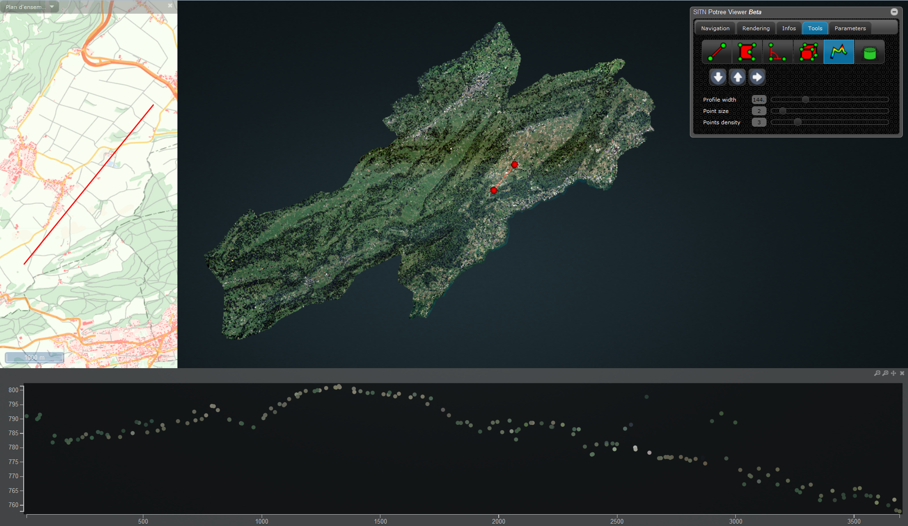

# README

## About

Potree Viewer is a free open-source user interface to display, explore and measure large points clouds based on the Level Of Detail (LOD) concept, thanks to Markus Schütz [Potree](http://potree.org).

The project is currently developped by [SITN](http://ne.ch/sitn) and focuses on the use of georeferenced point cloouds.

The purpose of Potree Viewer is to provide the largest public with a easy access to information rich LiDAR state-wide point clouds. For a live demo please test the [SITN Potree Viewer](http://sitn.ne.ch/lidar/index.html) by enhancing Potree with a intuitive, complete and stable UI.

## Features

Potree Viewer supports almost all of Potree features and in addition, provides:

* Enhanced intuitive UI thanks to [jQuery UI](https://jqueryui.com/)
* 3D - 2D interaction between the 3D scene and a 2D map (ongoing development)
* Efficient profile display, with 2D map synchronization (ongoing development)
* Multi-language UI thanks to [I18next](http://i18next.com/)
* Easy UI configuration from a single configuration file

## Showcase

Take a look at the (http://sitn.ne.ch/lidar/index.html) for live demo.

## Install

* Generate a point cloud out of georeferenced LiDAR data with [PotreeConverter](https://github.com/potree/PotreeConverter)
* Download the whole [Potree Viewer](https://github.com/potree/PotreeViewer) master branch as no build is available for now
* Edit the config/config.js file, in particular the <b>pointCloudPath</b> variable that is the most important
* If you plan, as we hope, to use a georeferenced point cloud, don't forget to edit the WMS/WMTS parameters in the config.js file
* If your point cloud uses other projections that EPSG:4326, 3857 or 21781, please edit this [line](https://github.com/potree/PotreeViewer/blob/master/index.html#L52) to load adequate projection definition

## Compatibility

| Browser              | OS      | Result        |
| -------------------- |:-------:|:-------------:|
| Chrome 42            | Win7    | works         |
| Firefox 37           | Win7    | works         |
| Internet Explorer 11 | Win7    | partially works; performance issues |

## Credits

* The 3D navigation, rendering and tools are all provided by [Potree](http://potree.org)
* The multi-res-octree algorithms used by Potree were developed at the Vienna University of Technology by Michael Wimmer and Claus Scheiblauer as part of the [Scanopy Project](http://www.cg.tuwien.ac.at/research/projects/Scanopy/).
* [Three.js](https://github.com/mrdoob/three.js), the WebGL 3D rendering library on which potree is built.
* [plas.io](http://plas.io/) point cloud viewer. LAS and LAZ support have been taken from the laslaz.js implementation of plas.io. Thanks to [Uday Verma](https://twitter.com/udaykverma) and [Howard Butler](https://twitter.com/howardbutler) for this!
* [Harvest4D](https://harvest4d.org/) Potree currently runs as Master Thesis under the Harvest4D Project
* [Martin Isenburg](http://rapidlasso.com/), [Georepublic](http://georepublic.de/en/), [Sigeom Sa](http://www.sigeom.ch/), [Pix4D](http://pix4d.com/) as well as all the contributers to potree and PotreeConverter and many more for their support.

## More snapshots

